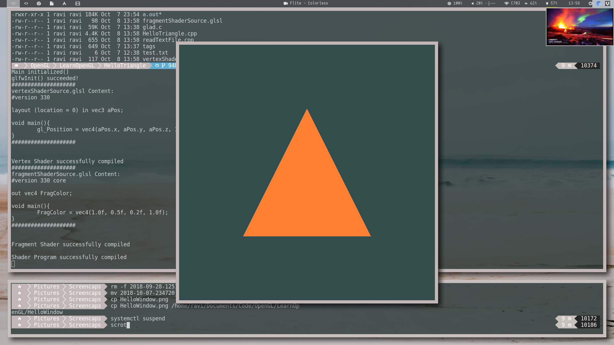
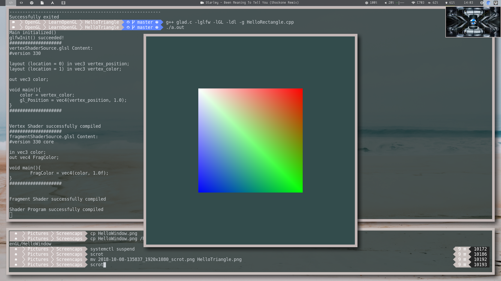

## HelloTriangle

>   A triangle within a color-cleared screen
>   Coordinates: {(-0.5, -0.5), (0.5, -0.5), (0, 0.5)}

## HelloRectangle
Interpolated with RGBW colors at each indice  
Uses EBO along with two VBOs (vertices & colors) within a VAO

>   A rectangle within a color-cleared screen
>   Coordinates: {(-0.5, -0.5), (0.5, -0.5), (0.5, 0.5), (-0.5, 0.5)}

